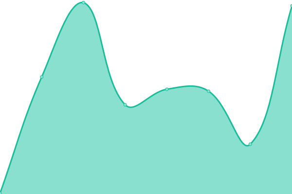
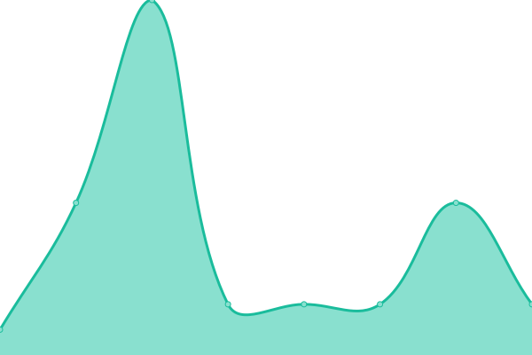
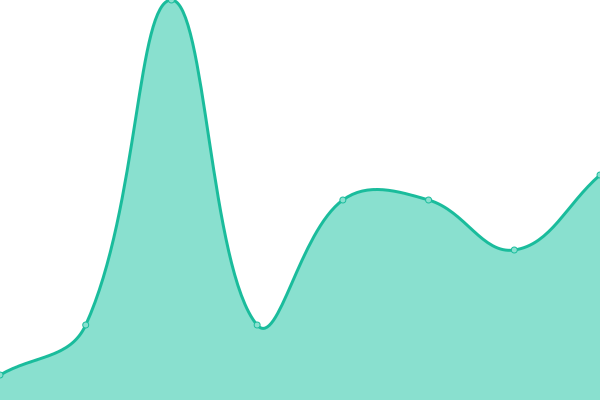
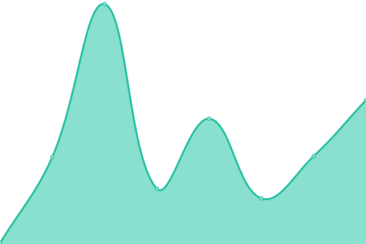
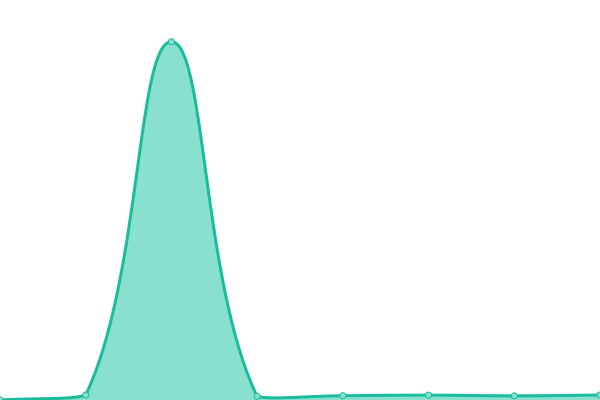

# [📈 Live Status](https://uptime.hloli.pw): <!--live status--> **🟩 All systems operational**

This repository contains the open-source uptime monitor and status page for [HLOLIG](https://uptime.hloli.pw), powered by [Upptime](https://github.com/upptime/upptime).

With [Upptime](https://upptime.js.org), you can get your own unlimited and free uptime monitor and status page, powered entirely by a GitHub repository. We use [Issues](https://github.com/HLOLIG/upptime-v1.3/issues) as incident reports, [Actions](https://github.com/HLOLIG/upptime-v1.3/actions) as uptime monitors, and [Pages](https://uptime.hloli.pw) for the status page.

<!--start: status pages-->
<!-- This summary is generated by Upptime (https://github.com/upptime/upptime) -->
<!-- Do not edit this manually, your changes will be overwritten -->
<!-- prettier-ignore -->
| URL | Status | History | Response Time | Uptime |
| --- | ------ | ------- | ------------- | ------ |
|  [Blog](https://blog.hloli.pw) | 🟩 Up | [blog.yml](https://github.com/HLOLIG/upptime-v1.3/commits/HEAD/history/blog.yml) | 

 192ms
     
 | 

<a href="https://uptime.hloli.pw/history/blog">100.00%</a>
    

|  Google DNS 1 | 🟩 Up | [google-dns-1.yml](https://github.com/HLOLIG/upptime-v1.3/commits/HEAD/history/google-dns-1.yml) | 

 12ms
     
 | 

<a href="https://uptime.hloli.pw/history/google-dns-1">100.00%</a>
    

|  US Server | 🟩 Up | [us-server.yml](https://github.com/HLOLIG/upptime-v1.3/commits/HEAD/history/us-server.yml) | 

 10ms
     
 | 

<a href="https://uptime.hloli.pw/history/us-server">100.00%</a>
    

|  Uptime page | 🟩 Up | [uptime-page.yml](https://github.com/HLOLIG/upptime-v1.3/commits/HEAD/history/uptime-page.yml) | 

 131ms
     
 | 

<a href="https://uptime.hloli.pw/history/uptime-page">100.00%</a>
    

|  [Google](https://www.google.com) | 🟩 Up | [google.yml](https://github.com/HLOLIG/upptime-v1.3/commits/HEAD/history/google.yml) | 

 77ms
     
 | 

<a href="https://uptime.hloli.pw/history/google">100.00%</a>
    

<!--end: status pages-->

[**Visit our status website →**](https://uptime.hloli.pw)

## 📄 License

- Powered by: [Upptime](https://github.com/upptime/upptime)
- Code: [MIT](./LICENSE) © [HLOLIG](https://uptime.hloli.pw)
- Data in the `./history` directory: [Open Database License](https://opendatacommons.org/licenses/odbl/1-0/)
